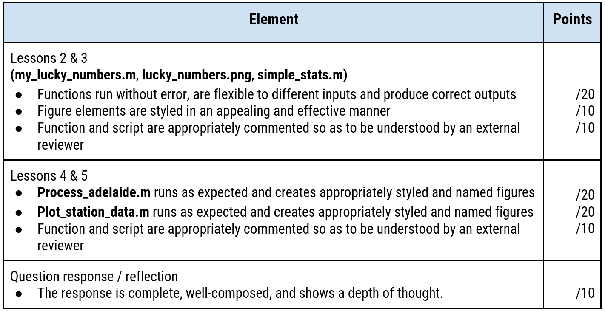

# Introduction
Scientific computing--using computer algorithms to solve scientific problems--plays an important role in research for many modern scientific disciplines. By developing computer programs that collect, refine, analyze, and visualize experimental data, scientists are able to explore new scientific hypotheses and broaden their understanding of physical phenomena and relationships. Even in cases where datasets are small and relatively straightforward, using scripted, programming approaches can greatly improve the efficiency and reproducibility of scientific analysis.

Further to this point, it is very likely that as your scientific career progresses, you will find yourself in a situation where using a programmatic approach is required to complete your research work, and/or immensely beneficial and time-saving in comparison to other approaches. Though you may not have expertise with a specific programming application, having knowledge of the basics of programming and scientific computing, and the confidence to experiment and continue to learn will be invaluable assets. To this end, the goal of this workshop is to develop both of these aspects, while also introducing you to best practices in creating and maintaining scientific code. 

The purpose of this workshop is to provide you with an introduction to the MATLAB software package and improve your knowledge of programming and scientific computing. In addition, you’ll have an opportunity to further explore climate change over the past decade through a (programmatic) re-visitation of the international weather station data used in your second assignment. 

## 1. Intro presentation
Watch Jay's introductory presentation to the assignment: 

#### Video 
<iframe width="853" height="480" src="https://web.microsoftstream.com/embed/video/439cf5ee-5dad-462e-a9a8-04f0c6de01d0?autoplay=false&amp;showinfo=true" allowfullscreen style="border:none;"></iframe>

#### Slides
<iframe src="https://docs.google.com/presentation/d/e/2PACX-1vT9zj8Ktv3CN4HAeDHGm8xeUuhDh0LDy8CZomZhuxCeEWjEafTyDSBrze91vQK9XNRf-Yu0RjtytcjG/embed?start=false&loop=true&delayms=60000" frameborder="0" width="960" height="569" allowfullscreen="true" mozallowfullscreen="true" webkitallowfullscreen="true"></iframe>

## 2. Objectives
By the end of this workshop, you will be able to:
- Compare and contrast the relative merits of performing analyses interactively (e.g. in spreadsheet) vs. programmatically (i.e. using a scripted approach).
- Identify situations where a programmatic approach would be beneficial.
- Explain the basic elements and principles of scientific programming.
- Run basic commands and execute functions in MATLAB.
- Use your programming knowledge and skills to create working scripts and functions. 
- Apply your new skills and knowledge in other programming languages.

## 3. Deliverables
For your final deliverables, you will upload to Avenue to Learn a few functions, a script, an image, and a document with a very short reflection. The full list of deliverables (described below) that will be uploaded to Avenue to Learn is: 
- A function named ```my_lucky_numbers.m``` (Created during [Lesson 2](lesson2))
- A figure named ```lucky_numbers.png``` (Created during [Lesson 2](lesson2))
- A function named ```simple_stats.m``` (Created during [Lesson 3](lesson3))
- A script named ```process_adelaide.m``` (Created during [Lesson 4](lesson4))
- A function named ```plot_station_data.m``` (Created during [Lesson 5](lesson5))
- A pdf document that provides a very short reflection on your experience

## 4. Assessment
**Date Assigned:**	2021/03/01  
**Date Due:** 		2021/03/21   
**Weight:** 		5 points  

### Assessment Rubric


## 5. Get started 
Ready to start? Head to the [preparation page](preparation) and follow the instructions to get your software (MATLAB Online) and data ready.
