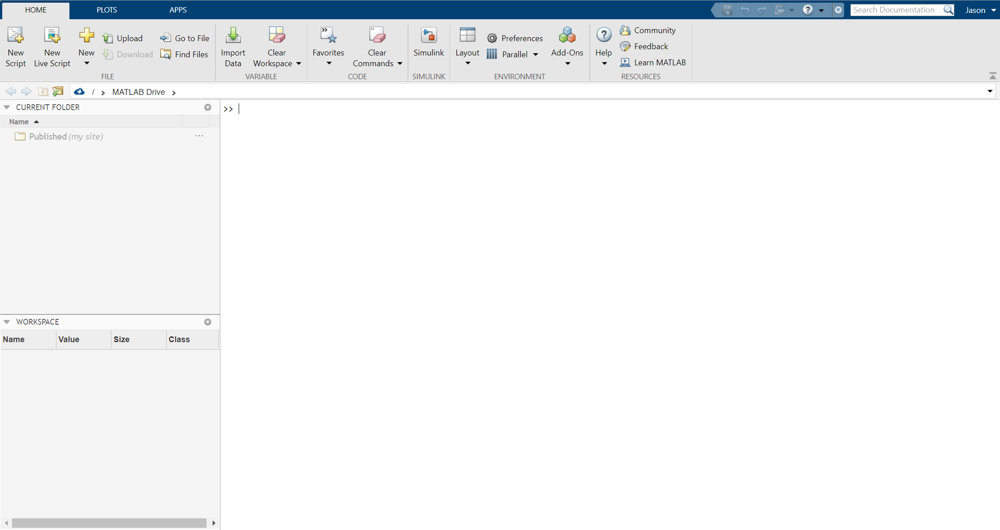

# Learn MATLAB
In this lesson, you'll become familiar with the MATLAB interface, and learn the basic syntax of programming in MATLAB. 

## 1. The MATLAB interface

By default, the MATLAB Online interface consists of following panels: 
- The tool panels at the top (which include ```HOME```, ```PLOTS```, and ```APPS``` tabs.
- The path selector, which will be set initially to ```/ > MATLAB DRIVE```. This indicates the directory where MATLAB is currently set to operate.
- The **CURRENT FOLDER** browser, which will show the files and folders in your MATLAB Drive.
- The **WORKSPACE**, which allows you to view/edit data (variables) that you've imported or created.
- The **COMMAND WINDOW**, which allows you to enter commands to MATLAB (after the ```>>``` prompt).

## 2. Numeric variables

### 2.1 Assigning and naming variables
- Into Command Window, enter a single digit, such as ```8```.  Notice how MATLAB assigns the inputted value to a variable called ```ans```. MATLAB stores all values that are given to it as variables. ```ans``` is the default name given to a variable if a name is not specified.  
- Now enter another digit into the Command Window, like ```7```. Notice that ```ans=8``` is now overwritten by ```ans=7```. 
- To avoid overwritting variables and to make more useful variable names, you can assign names and values to variables: 
```
a = 8
b = 7
test123 = 12
c = a;
```
- In your **Workspace**, you'll see that you have ```a```, ```b```, ```c``` and ```test123``` listed.  You can view the value of a variable by typing the variable name back into the command window:  
```
test123
``` 
- You may have also noticed that MATLAB has echoed your commands in the **Command Window**.  Use a semicolon at the end of a command to avoid the echo:  
```
test123 = 14;
```

### 2.2 Removing a variable from the workspace
- You can remove a variable from your workspace by using the ```clear``` function.
  - e.g. ```clear c``` will remove the variable ```c```.
- You can remove all variables in the **Workspace** with the ```clearvars``` command.
  - e.g. ```clearvars``` will remove all variables (but don't do this right now). 
- You can clear the contents of the **Command Window** at any time by typing ```clc```.

### 2.3 Scalars, Vectors and Matrices
All previous variables you've created to this point are *scalars* (i.e. 1 row x 1 column). You can use brackets (```[``` and ```]```) to create vectors and matrices.  
- e.g. Create a 1x5 **row vector** (i.e. 1 row and 5 columns) by placing spaces between values:  
```
rv1 = [2 19 3 -3 4]
```
- e.g. Create a 5x1 **column vector** (i.e. 5 rows and 1 column) by using the semicolon (;) to start a new row:
```
cv1 = [31; 8; -10; 39; 2] 
```

- An apostrophe after the vector/matrix transposes it. e.g. Transpose a row vector into a column vector by adding ```'```: 
```
cv2 = [31 a -10 39 2]'
```

- **Matrices** can be created by expanding the examples above into multiple rows and columns. 
  - e.g. Create a 5x4 (5 rows x 4 columns) matrix called ```mymatrix1```: 
```
mymatrix1 = [12 4 2 1; 13 4 1 23; 39 20 10 9; 3 -22 -12 0; 78 -6 -3 2];
```

### 2.4 Not a Numbers (NaN)
Occasionally, matrices can have missing values. In such cases, you can use the notation ```NaN``` to indicate that there is a missing value in an element of a matrix. This is important when the location of values in a matrix are important (e.g. a time series collected at regular intervals). **Note:** The value NaN is a special character recognized by MATLAB as a null value. Any normal operations that are carried out on variables containing NaNs will result in NaN.
- e.g. Create a matrix with a couple of ```NaN``` values:  
``` 
cv3 = [4 NaN 5; 9 10 NaN; 8 10 4];
```

### 2.5 Referencing elements in vectors, matrices
You can reference specific elements in a vector/matrix using parentheses (```(``` and ```)```). **NOTE** that locations are specified by (row# , column#), and you can use the colon (```:```) operator to specify an entire row or column.
- e.g. Assign variable ```d``` the value of the element in row3, column3 of ```matrix1```
```
d = mymatrix1(3,3); 
```
- e.g. Assign variable ```e``` the value of entire first column of ```matrix1```
```
e = mymatrix1(:,1); 
```

### 2.6 Exercise 
1. Create a 6x2 matrix, name it ```mymatrix2```.
2. Create a new variable called ```mycolumn```, which consists of the second column of mymatrix2.

## 3. Operations (arithmetic, trigonometric, statistical)

### 3.1 Arithmetic operations
- Common arithmetic operations use the expected operations, e.g.: 
```
23+7        % Add:
a-b         % Subtract
23*a        % Multiply
23/b        % Divide
d = 8^2.5   % Exponent
sqrt(a+b)   % square root:
```

- Arithmetic operations can also be used on vectors and matrices, e.g.: 
```
cv1 - 8      		% subtract 8 from each element
cv1 / 8      		% divide each element by 8
sqrt(mymatrix1)    	% notice the imaginary parts where mymatrix1 values are negative
```

- You can **add or subtract two vectors element-wise** (like subtracting values in one column in Excel from another) using arithmetic operations, e.g.: 
```
cv1-cv2 % subtract elements of cv2 from cv1
```
  - **NOTE** that element-wise addition or subtraction will only work if both vectors/matrices are the same size--otherwise, you'll get an unexpected result or an error. For example, ```cv1-rv1``` will give you a 5x5 matrix result, where cv1 and rv1 are replicated to 5x5 matrices and then subtracted from each other element-wise. 
  
- For multiplication and division, placing a period in front of the operator specifies an element-wise operation, e.g;
```
cv3 = cv1.*cv2; % element-wise multiplication
cv4 = cv1./cv2; % element-wise division
```
  - **NOTE** that performing these operations without periods before the operators will do something different. e.g: 
    - ```rv1*cv1``` will perform matrix multiplication
	- ```rv1/cv1``` will return an error, as it is attempting to solve a set of linear equations.
	
### 3.2 Logarithmic, trigonometric operations
See examples below: 
```
log_d = log(d)      		% natural logarithm
log10_d = log10(d)  		% base10 logarithm
exp_cv1 = exp(cv1)      	% natural exponent
cos_m1 = cos(matrix1)      	% cosine function
sin_d = sin(d)     			% sine function
tan_d = tan(d)  			% tangent function
```

### 3.3 Statistical operations
See examples below: 
```
mean_cv1 = mean(cv1)		% mean
mode_cv1 = mode(cv1)		% mode
std_m1 = std(matrix1) 		% standard deviation; notice it takes the standard deviation for each column
std_m1b = std(matrix1,0,2) 	% This will take stdev across rows, instead.
var_m1 = var(matrix1)		% variance
```

## 4. Learning more about MATLAB
- There are two helpful commands for learning more about what a MATLAB function (like ```mean```, for example) does: 
  - To view help documentation in the command window type ```help``` and the name of the function 
    - e.g. ```help mean;``` 
  - To view documentation in a separate window, type ```doc``` and the name of the function 
    - e.g. ```doc mean;``` 

## 5. Open a new script
To this point, you have entered all of your operations into the command window. This is fine if you only have to perform a couple of operations a few times, but if you want to build a set of connected and repeatable commands, it's best to create a ***script*** or ***function***. (We'll discuss functions later).

- In MATLAB, click the ```New Script``` button to open a new script. Complete the rest of this lesson in the new script, but typing each command into a new line. 
  - **Tip1** You can execute all lines in a script (i.e. send them to the command window) at once by clicking the ```Run``` button.
  - **Tip2** You can execute a line (or set of lines) of code in a script by highlighting them and pressing the **F9 key**. This is very helpful!
  
## 6. Types of MATLAB arrays
To this point, we've worked entirely with numeric arrays. MATLAB provides for a number of other variable types to be used. Typically, the most appropriate variable type depends on the nature of your data and your desired processes and outcomes. Here are the MATLAB  variable types:

- **integer** arrays (of varying length, signed/unsigned)
- **numeric** arrays (real numbers)
- **logical** arrays (values of 1 or 0, representing true and false)
  - e.g. ```f = [12 -3 NaN 7];``` ```list_nans = isnan(f)```
- **character** arrays (strings stored as vectors of characters)
  - e.g. ```char1 = 'my first string';``` ```char2 = 'is not my last';```
- **cell** arrays (array of indexed cells, each capable of storing an array of different dimension and type; think of Excel spreadsheets, if each cell could contain countless more cells inside of it)
  - e.g. ```cell1 = {345, 'Mazda', [34 43]; 34, NaN, 'zoom'}```
- **structure** arrays (expandable tree of variables, which can each be of different size and type)
  - e.g. ```s.a = 1; s.b = {'A','B','C'}; ```
- **objects** (user classes and java classes)  

Below, you'll learn a bit more about basic array types.

### 6.1 Numeric arrays
You've already had a basic introduction to numeric arrays through your work with scalars, vectors and matrices. 

### 6.2 Character arrays  
1. Create two character arrays using strings of characters; assign them variable names. e.g.:  
```
char1 = 'my first string' 
char2 = 'is not my last'
```  
2. Combine (concatenate) the two character arrays into a new single character array. e.g.: 
```
char3 = [char1 char2];
```
3. Figure out how to insert another string between char1 and char2

### 6.3 Cell arrays
1. Create a 2x2 cell array, where one of the cells contains: 
  - a scalar (i.e. a single numeric value). e.g.: ```cell1{1,1} = 99;```
  - a character array. e.g.:  ```cell1{1,2} = 'bottles of beer on the wall';```
  - a matrix. e.g.: ```cell1{2,1} = [1 2 3; 4 5 6; 7 8 9];```
  - a NaN. e.g.: ```cell1{2,2} = NaN;```
2. Double click on your cell array in the **Workspace** to inspect it in the **Viewer** window 

### 6.4 Structure arrays
1. Enter the following into your script and execute it: 
```
student(1).name = 'John';
student(1).age = 23;
student(2).name = 'Sabrina';
student(2).age = 24;
```
2. Create a new type of category for both students named ```grade``` and give each student a value.

## 7. Running your newly-created script
- In the **Command window**, clear all variables from the workspace with the ```clearvars;``` command 
- Run your script using the ```Run``` button. Note that you will be required to save it. Give it a useful name (no spaces or dashes) and save it to the same directory as the rest of your work.

## 8. Proceed to the next lesson. 
All done? Head to the [intermediate lesson](lesson2).