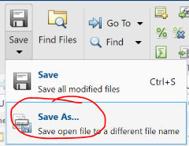

# Lesson 2: Intermediate Operations
In this lesson, you will build upon the [basics](lesson1) to create working scripts and functions and perform some analyses. 

1. Make sure your **Working Directory** is set to ```/ > MATLAB Drive > iSci3A12-SciProgramming```. This is where we will run our scripts and analyses. 
1. In MATLAB, open the following files in the **Editor** window: 
  - The script ```iSci_Intermediate.m```, and 
  - The function ```iSci_lucky_numbers.m```

## 1. Edit and save a new function
1. Save a copy of ```iSci_lucky_numbers.m``` in the same direcotory and name it ```my_lucky_numbers.m```:
  - With ```iSci_lucky_numbers``` open, click ```Save > Save As...```
  
  - Name the new file ```my_lucky_numbers.m```
1. In the *function declaration* (the top line) in ```my_lucky_numbers.m```, change the function name from ```iSci_lucky_numbers``` to ```my_lucky_numbers```. Save your changes. 
  - **NOTE**: When you call a function, it will execute the *last saved version* of the file. As a result, you need to save your changes to a function before it will be reflected in the output.

## 2. Completing the lesson 

### 2.1 Understand my_lucky_numbers
1. Read through the code and comments in ```my_lucky_numbers```. You don't need to understand every command, but try to get a sense of the logic behind the function. 
1. Edit your ```my_lucky_numbers``` function so that instead of returning numbers between 1 and 49, it returns numbers between 1 and 100. 
  - **HINT**: Find the value ```49``` in the code and replace it with ```100```.
  - Save your changes. 
  
### 2.2 The scenario
You’ve been given a "lucky number generating program" from a friend (called ```my_lucky_numbers```). You suspect that it’s outputting nothing but uniformly random numbers between 1 and 100. How can you investigate this?

### 2.3 The analysis
<table style="background-color: #ffff99;">
<tbody>
<tr>
<td>
<p><b>IMPORTANT NOTE:</b> For this lesson, you will work through the exercises within the script <b>iSci_Intermediate.m</b>. The instructions are embedded as comments in the script, and you can run through the steps by highlighting line(s) and executing them in the Command Window with the F9 key.</p>
</td>
</tr>
</tbody>
</table>

## 3. Deliverables
- Be sure to download respond to the question provided in your response sheet. 
- Ensure that your figure 'lucky_random_numbers.png' has been created. You'll download this at the end to submit. 

## 4. Head to the next section
Once you're done here, head to the [next lesson](lesson3) to begin working with your climate data to automate analyses and visualization. 