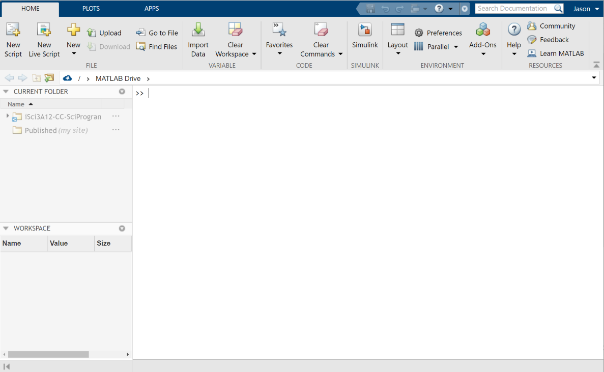
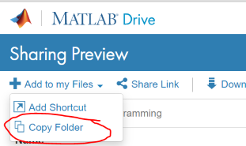

# Preparation

## Activate MATLAB online
As a student at McMaster, you have access to MATLAB through McMaster's [web portal](https://www.mathworks.com/academia/tah-portal/mcmaster-university-31501097.html). From this portal, you can download the MATLAB installer to install it on your local desktop or laptop, or access and use MATLAB online--an completely online version of the software. For this assignment, we'll be using the online version. If you don't already have one, you'll be required to create a MathWorks account. 
<br>
**To activate your MATLAB account and open MATLAB online:**
- Navigate to https://www.mathworks.com/products/matlab-online.html
- Click **Start using MATLAB Online**
- On the MATLAB Online login page, choose to **create an account**

- On the registration page, enter your information. **BE SURE to use your McMaster email address!**

- Follow the link to **create your profile through the university**. Use your MAC ID credentials.

- Finally, [sign in to MATLAB Online](https://matlab.mathworks.com/) using your MathWorks credentials to start using it. 

<table style="background-color: #ffff99;">
<tbody>
<tr>
<td>
<p><b>NOTE:</b> After connecting your account the first time, you only need to go to the <a href="https://matlab.mathworks.com/">sign in page</a> to access MATLAB Online. </p>
</td>
</tr>
</tbody>
</table>

## The MATLAB interface

By default, the MATLAB Online interface consists of following panels: 
- The tool panels at the top (which include ```HOME```, ```PLOTS```, and ```APPS``` tabs.
- The path selector, which will be set initially to ```/ > MATLAB DRIVE```.
- The **CURRENT FOLDER** browser, which will show the files and folders in your current path.
- The **WORKSPACE**, which allows you to view/edit data (variables) that you've imported or created.
- The **COMMAND WINDOW**, which allows you to enter commands to MATLAB (after the ```>>``` prompt).

## Get the assignment data pack into MATLAB Online
Before you can begin the assignment, the assignment pack materials need to be uploaded to your [MATLAB Drive](https://drive.matlab.com/files/). This will make these files usable in MATLAB Online. Two options for doing this have been outlined below--**you only need to complete one option**. 

### Option 1: Using a MATLAB Drive share
- Click on [this link](https://drive.matlab.com/sharing/3d411629-c97a-490e-b7bb-479b87616cdb) to view the shared assignment data pack in MATLAB Drive. 
- In the **Sharing Preview** page, select ```+ Add to my Files > Copy Folder```

- You should now see a folder called ```iSci3A12-CC-SciProgramming``` in your MATLAB Drive and in MATLAB Online. 

### Option 2: Upload files


 
## Upload your assignment files to MATLAB Drive


- Clone the assignment repository to your local GitHub account using [this link](). 
- In your cloned repository, click the green ```Code``` button  and choose to ```Download ZIP```. Download the zip file to your local computer. 
- Extract the 


- In MATLAB, use the upload function  to upload all contents of your extracted assignment pack. 
- 


### Option 2 - Matlab Drive? 
An assignment 


## Introduction to Matlab
1. Complete short introductory presentation
2. Navigate to our course github repository: https://github.com/3IE1/SciComp-2019 
- Click on 'Clone or Download' and Download the zip file to the /Downloads directory of the computer and unzip it. This is now your working directory.
- 